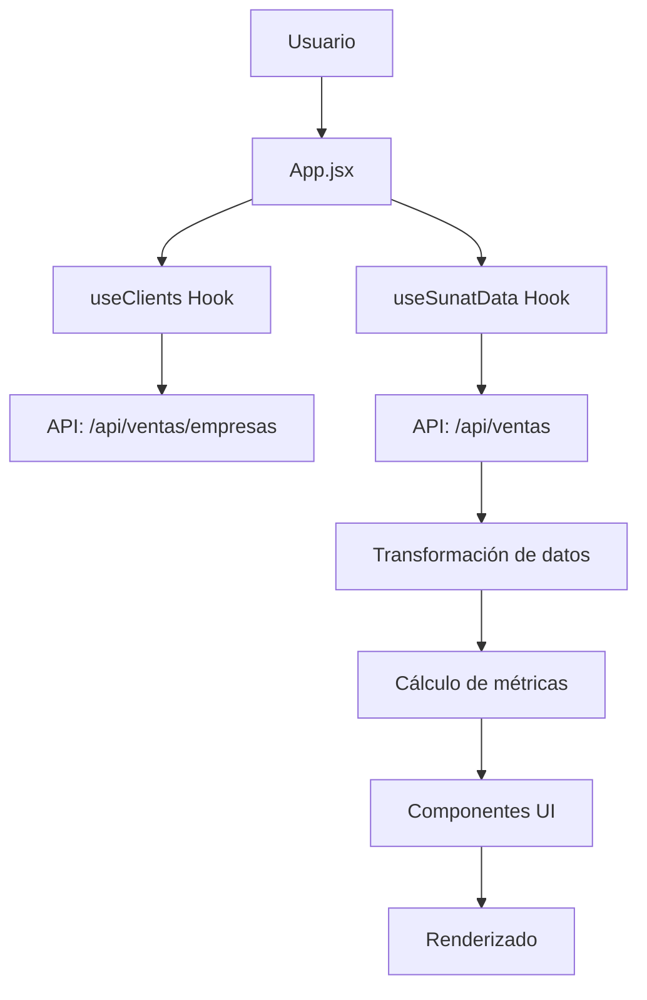

# Arquitectura Frontend - Operaciones Perú

## 📋 Resumen

Este documento describe la arquitectura frontend del sistema **Operaciones Perú**, una aplicación web para gestión de operaciones financieras (factoring/financiamiento) con módulos especializados.

---

## 🏗️ Estructura General

```
verificador-frontend/
├── src/
│   ├── App.jsx                          # Router principal (React Router DOM)
│   ├── main.jsx                         # Entry point de React
│   ├── firebase.js                      # Configuración de Firebase Auth
│   │
│   ├── pages/                           # Páginas principales
│   │   ├── LoginPage.jsx               # Autenticación Firebase
│   │   ├── Dashboard.jsx               # Dashboard de ventas
│   │   ├── Gestiones.jsx               # Gestión de operaciones
│   │   ├── NewOperationPage.jsx        # Crear operación
│   │   ├── SunatPage.jsx               # Wrapper del módulo SUNAT
│   │   └── Sunat/                      # Módulo SUNAT (ver detalle abajo)
│   │
│   ├── components/                      # Componentes reutilizables
│   │   ├── gestiones/                  # Específicos para gestiones
│   │   │   ├── AdelantoExpressModal.jsx
│   │   │   ├── AssignOperationModal.jsx
│   │   │   ├── DashboardSidebar.jsx
│   │   │   ├── GestionPanel.jsx
│   │   │   ├── Header.jsx
│   │   │   ├── OperationCard.jsx
│   │   │   └── RequestVerificationModal.jsx
│   │   ├── ui/                         # Componentes UI genéricos
│   │   │   ├── Button.jsx
│   │   │   ├── Card.jsx
│   │   │   ├── Input.jsx
│   │   │   ├── Modal.jsx
│   │   │   ├── ProgressBar.jsx
│   │   │   └── Textarea.jsx
│   │   ├── FileInput.jsx
│   │   ├── FileListItem.jsx
│   │   ├── FormSection.jsx
│   │   ├── Icon.jsx
│   │   ├── ProcessingModal.jsx
│   │   └── ToggleSwitch.jsx
│   │
│   ├── context/                         # Context API
│   │   └── AuthContext.jsx             # Estado global de autenticación
│   │
│   ├── hooks/                           # Custom hooks globales
│   │   └── useGestiones.js             # Lógica de gestiones
│   │
│   ├── config/                          # Configuración
│   │   └── api.js                      # URLs de API
│   │
│   └── utils/                           # Utilidades globales
│       └── dateFormatter.js
│
├── public/                              # Assets estáticos
├── package.json                         # Dependencias
├── vite.config.js                       # Config de Vite
├── tailwind.config.js                   # Config de Tailwind CSS
└── firebase.json                        # Config de Firebase Hosting
```

---

## 🎯 Patrones de Arquitectura Implementados

### 1. **Arquitectura Modular por Feature**

Cada módulo principal (Sunat, Gestiones, Dashboard) tiene su propia estructura interna con componentes, hooks y utilidades específicas.

**Ventajas:**
- ✅ Alta cohesión: código relacionado está junto
- ✅ Bajo acoplamiento: módulos independientes
- ✅ Fácil de escalar: agregar nuevos módulos sin afectar existentes
- ✅ Facilita el trabajo en equipo: cada dev puede trabajar en un módulo

### 2. **Separation of Concerns**

```
UI Components (Presentación)
      ↓
Custom Hooks (Lógica de negocio)
      ↓
Context API (Estado global)
      ↓
Services/API (Datos)
```

### 3. **Component Composition**

Componentes pequeños y reutilizables que se combinan para formar interfaces complejas.

---

## 📦 Módulo SUNAT - Arquitectura Detallada

### Estructura del Módulo

```
pages/Sunat/
├── App.jsx                              # ✨ Componente principal (refactorizado)
├──
├── components/                          # 🎨 Componentes de UI
│   ├── MultiClientSelector.jsx         # Selector de clientes con búsqueda
│   ├── MultiCurrencySelector.jsx       # Selector de monedas (PEN/USD)
│   ├── KPIDashboard.jsx                # Dashboard de métricas
│   ├── PeriodSelector.jsx              # Selector de períodos
│   ├── BulkActionToolbar.jsx           # Barra de acciones masivas
│   ├── InvoiceTable.jsx                # Tabla detallada de facturas
│   ├── GroupedInvoiceTable.jsx         # Tabla agrupada de facturas
│   └── MetricCard.jsx                  # Tarjeta de métrica individual
│
├── hooks/                               # 🪝 Custom hooks
│   ├── useClients.js                   # Lógica de carga de clientes
│   └── useSunatData.js                 # Lógica de datos y métricas
│
├── constants/                           # 📌 Constantes
│   └── index.js                        # API_BASE_URL, INVOICE_STATUSES, etc.
│
├── icons/                               # 🎨 Iconos SVG
│   └── index.jsx                       # Exporta todos los iconos
│
└── utils/                               # 🔧 Utilidades
    └── formatters.js                   # formatCurrency, formatPeriodDisplay
```

### Flujo de Datos



### Responsabilidades de Cada Capa

#### **App.jsx (Orquestador)**
- ✅ Gestiona el estado de UI (filtros, paginación, selecciones)
- ✅ Orquesta los hooks personalizados
- ✅ Transforma datos para los componentes
- ✅ Maneja eventos y callbacks
- ❌ NO hace fetch directo de datos
- ❌ NO contiene lógica de negocio compleja

**Reducción de código:**
- **Antes:** 901 líneas
- **Después:** 386 líneas
- **Reducción:** 57% menos código

#### **Custom Hooks (Lógica de Negocio)**

**`useClients.js`**
- ✅ Carga lista de clientes del período
- ✅ Maneja autenticación con Firebase
- ✅ Maneja errores y estados de carga

**`useSunatData.js`**
- ✅ Carga ventas paginadas
- ✅ Carga todas las facturas para métricas
- ✅ Calcula fechas según filtros
- ✅ Maneja autenticación y renovación de tokens
- ✅ Aplica filtros (clientes, monedas, fechas, ordenamiento)

#### **Componentes de Presentación**

**Características:**
- ✅ Reciben datos via props
- ✅ Emiten eventos via callbacks
- ✅ No tienen lógica de negocio
- ✅ Son reutilizables y testeables
- ✅ Siguen principio de responsabilidad única

**Ejemplos:**

```jsx
// ✅ BUENO: Componente de presentación puro
<MultiClientSelector
    clients={clients}
    selectedClientIds={selectedClientIds}
    onSelectionChange={handleChange}
/>

// ❌ MALO: Componente que hace fetch
<MultiClientSelector />  // Hace fetch interno
```

---

## 🔑 Principios de Diseño Aplicados

### 1. **Single Responsibility Principle (SRP)**
Cada componente/hook tiene una única responsabilidad:
- `useClients` → Solo carga clientes
- `useSunatData` → Solo carga datos de ventas
- `MultiClientSelector` → Solo muestra y selecciona clientes

### 2. **Don't Repeat Yourself (DRY)**
- Lógica de autenticación centralizada en hooks
- Formateo de moneda/fechas en utilidades
- Iconos reutilizables exportados desde un solo lugar

### 3. **Separation of Concerns**
- UI ≠ Lógica de negocio ≠ Datos
- Componentes de presentación vs contenedores
- Estado local vs estado global

### 4. **Composition over Inheritance**
```jsx
// Composición de componentes
<KPIDashboard>
  <KPICard>
    <ProgressBar />
  </KPICard>
</KPIDashboard>
```

---

## 🚀 Tecnologías y Librerías

### Core
- **React 19** - Framework de UI
- **Vite** - Build tool y dev server
- **React Router DOM** - Routing

### Styling
- **Tailwind CSS** - Utility-first CSS framework
- **Framer Motion** - Animaciones (usado en algunos componentes)

### Backend Integration
- **Firebase Authentication** - Auth con roles (admin, ventas, gestion)
- **Firebase Hosting** - Despliegue
- **REST APIs** - Comunicación con backends (SUNAT backend, Orchestrator)

### State Management
- **React Context API** - Estado global (AuthContext)
- **React Hooks** - Estado local (useState, useEffect, useMemo)
- **Custom Hooks** - Lógica reutilizable

---

## 📐 Convenciones de Código

### Nomenclatura

```javascript
// Componentes: PascalCase
MultiClientSelector.jsx
KPIDashboard.jsx

// Hooks: camelCase con prefijo 'use'
useClients.js
useSunatData.js

// Utilidades: camelCase
formatCurrency()
formatDateToDMY()

// Constantes: UPPER_SNAKE_CASE
API_BASE_URL
INVOICE_STATUSES
```

### Estructura de Componentes

```jsx
// 1. Imports
import React, { useState } from 'react';
import { useAuth } from '../../context/AuthContext';
import MultiClientSelector from './components/MultiClientSelector';

// 2. Constantes locales (si aplica)
const DEFAULT_PAGE_SIZE = 20;

// 3. Componente
export default function App() {
    // 3.1 Hooks (contexto, estado, refs)
    const { user } = useAuth();
    const [data, setData] = useState([]);

    // 3.2 Efectos
    useEffect(() => {
        // ...
    }, []);

    // 3.3 Handlers
    const handleClick = () => {
        // ...
    };

    // 3.4 Render
    return (
        <div>
            {/* JSX */}
        </div>
    );
}
```

### Custom Hooks Pattern

```javascript
export const useCustomHook = (params) => {
    const [data, setData] = useState(null);
    const [loading, setLoading] = useState(false);
    const [error, setError] = useState(null);

    useEffect(() => {
        // Fetch data
    }, [params]);

    return { data, loading, error };
};
```

---

## 🎨 Sistema de Diseño

### Colores (Tailwind)
```javascript
// Primarios
- blue-600: Acciones principales
- gray-*: Textos y fondos
- red-600: Errores
- green-600: Éxitos

// Por estado de factura
- slate: Sin Gestión
- blue: Tasa
- amber: Riesgo
- stone: No Califica
- emerald: Ganada
- rose: Perdida sin Gestión
```

### Espaciado
```javascript
- p-2, p-3, p-4: Padding
- gap-2, gap-3, gap-4: Grid/Flex gap
- rounded-md, rounded-lg, rounded-xl: Border radius
```

### Tipografía
```javascript
- text-xs: 12px
- text-sm: 14px
- text-base: 16px
- text-lg: 18px
- text-xl: 20px

- font-semibold: 600
- font-bold: 700
```

---

## 🔒 Seguridad

### Autenticación
1. Firebase Authentication con roles (admin, ventas, gestion)
2. Tokens JWT renovables automáticamente
3. Protected routes con `<ProtectedRoute>` wrapper
4. Auto-logout en errores 401/403

### Autorización
```javascript
// Roles y permisos
{
  admin: ['dashboard', 'gestiones', 'sunat', 'users'],
  ventas: ['dashboard', 'new-operation', 'sunat'],
  gestion: ['gestiones']
}
```

### Validación
- Validación en frontend (UX)
- Validación en backend (seguridad)
- Sanitización de inputs

---

## 📊 Métricas de Rendimiento

### Code Splitting
Actualmente hay una advertencia de bundle size (1.4 MB). Mejoras sugeridas:

```javascript
// Lazy loading de páginas
const Gestiones = React.lazy(() => import('./pages/Gestiones'));
const SunatPage = React.lazy(() => import('./pages/SunatPage'));

// Uso con Suspense
<Suspense fallback={<Loading />}>
  <Gestiones />
</Suspense>
```

### Optimizaciones Implementadas
- ✅ `useMemo` para cálculos costosos
- ✅ `useCallback` para funciones en dependencias
- ✅ Paginación de datos (20 items por página)
- ✅ Filtrado en backend (no en frontend)

---

## 🧪 Testing (Recomendado)

### Stack Sugerido
```bash
npm install --save-dev vitest @testing-library/react @testing-library/jest-dom
```

### Estructura de Tests
```
src/
├── pages/
│   └── Sunat/
│       ├── __tests__/
│       │   ├── App.test.jsx
│       │   ├── hooks/
│       │   │   ├── useClients.test.js
│       │   │   └── useSunatData.test.js
│       │   └── components/
│       │       ├── MultiClientSelector.test.jsx
│       │       └── KPIDashboard.test.jsx
```

### Ejemplo de Test
```javascript
import { describe, it, expect } from 'vitest';
import { render, screen } from '@testing-library/react';
import MultiClientSelector from '../components/MultiClientSelector';

describe('MultiClientSelector', () => {
    it('should render all clients', () => {
        const clients = [
            { id: '1', name: 'Client 1', ruc: '12345' }
        ];
        render(<MultiClientSelector clients={clients} />);
        expect(screen.getByText('Client 1')).toBeInTheDocument();
    });
});
```

---

## 🚀 Deployment

### Build para Producción
```bash
npm run build
```

### Deploy a Firebase Hosting
```bash
# Opción 1: Script automatizado
./deploy.ps1  # Windows
./deploy.sh   # Linux/Mac

# Opción 2: Manual
npm run build
firebase deploy --only hosting
```

### Configuración de Firebase
```json
// firebase.json
{
  "hosting": {
    "public": "dist",
    "ignore": ["firebase.json", "**/.*", "**/node_modules/**"],
    "rewrites": [
      {
        "source": "**",
        "destination": "/index.html"
      }
    ]
  }
}
```

---

## 📈 Escalabilidad Futura

### 1. **Agregar Nuevos Módulos**
```
src/pages/
└── NuevoModulo/
    ├── App.jsx
    ├── components/
    ├── hooks/
    ├── constants/
    ├── icons/
    └── utils/
```

### 2. **State Management Avanzado**
Si la app crece mucho, considerar:
- **Redux Toolkit** - Para estado global complejo
- **Zustand** - Alternativa más ligera a Redux
- **TanStack Query** - Para cache y sincronización de datos del servidor

### 3. **Micro-Frontends**
Para escalar a múltiples equipos:
```
operaciones-peru.web.app/
├── /sunat      → Micro-frontend SUNAT
├── /gestiones  → Micro-frontend Gestiones
└── /dashboard  → Micro-frontend Dashboard
```

---

## 🎓 Mejores Prácticas Aplicadas

### ✅ DO (Hacer)
- Separar componentes de presentación de contenedores
- Usar custom hooks para lógica reutilizable
- Mantener componentes pequeños (<300 líneas)
- Usar TypeScript (recomendado para el futuro)
- Documentar componentes complejos
- Manejar estados de carga y error
- Validar props con PropTypes o TypeScript

### ❌ DON'T (No hacer)
- No mezclar lógica de negocio en componentes de UI
- No hacer fetch directo en componentes (usar hooks)
- No repetir código (DRY)
- No mutar estado directamente
- No usar `any` en TypeScript
- No commits directos a main (usar PR)

---

## 📚 Recursos y Referencias

### Documentación
- [React Docs](https://react.dev/)
- [Vite Docs](https://vitejs.dev/)
- [Tailwind CSS](https://tailwindcss.com/)
- [Firebase Docs](https://firebase.google.com/docs)

### Patrones
- [React Patterns](https://reactpatterns.com/)
- [JavaScript Patterns](https://www.patterns.dev/)

---

## 👥 Contribuyendo

### Flujo de Trabajo
1. Crear feature branch: `git checkout -b feature/nueva-funcionalidad`
2. Hacer cambios y commits descriptivos
3. Crear Pull Request
4. Code review
5. Merge a main
6. Deploy automático (Firebase Hosting)

### Commit Convention
```bash
feat: nueva funcionalidad
fix: corrección de bug
refactor: refactorización de código
docs: actualización de documentación
style: cambios de formato
test: agregar tests
chore: tareas de mantenimiento
```

---

## 📞 Contacto y Soporte

Para preguntas sobre la arquitectura o implementación, contactar al equipo de desarrollo.

---

**Última actualización:** 2025-10-31
**Versión:** 2.0.0 (Post-refactorización)
